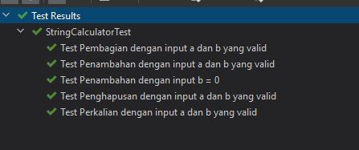

# Belajar Basic TDD Menggunakan Java dan Junit 5

Project ini adalah untuk mempelajar methodogy TDD (Test Driven Development) yaitu pendekatan pengembangan 
perangkat lunak yang didasarkan pada test. Sehingga nantinya kualitas dari kode yang 
sudah dibuat itu dapat terjaga.

### Prerequisite
Disini saya menggunakan bahasa pemrograman Java 

### Requirement
Buatlah sebuah program kalkulator sederhana (tambah, kurang, bagi, kali) dimana dari fitur 
diatas kita tambahkan beberapa persyaratan kembali yaitu :
- Tuliskan hasil output nya berupa String
- Jika pembagian ada yang dibagi dengna nilai o => maka keluarkan response Cannot divided by Zero
- Jika input satu kosong, maka keluarkan output => "Silahkan input parameter ke-1"
- Jika input dua kosong, maka keluarkan output => "Silahkan input parameter ke-2"
- Jika input satu dan dua kosong, maka keluarkan output => "Silahkan input parameter satu dan dua"

